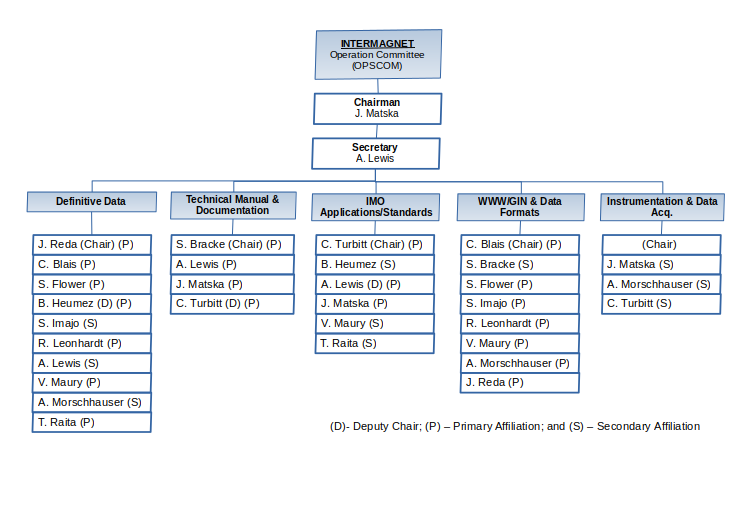

.. _inter_man:

INTERMAGNET Management
======================

The  Executive Council establishes policy for INTERMAGNET, deals
with questions of international participation and data
exchange, and communicates with national agencies and
international scientific and funding agencies.

.. table:: Executive Council membership
    :widths: auto
    :align: center

    ============== =========================
    David Boteler  Canada (Chairman)
    Ellen Clarke   United Kingdom
    Gauthier Hulot France
    Kristen Lewis  United States of America
    Andrew Lewis   Australia
    Jürgen Matzka  Germany
    ============== =========================

The Operations Committee advises the Executive Council on
matters relating to magnetic sensors, data capture and data
processing, and on communications options, protocols, etc. The
Operations Committee is also responsible for establishing and
maintaining standards of operation and uniform data formats and
transmission characteristics which optimize global exchange.

.. table:: Operations Council membership
    :widths: auto
    :align: center

    ====================== ==============
    Charles Blais          Canada
    Stephan Bracke         Belgium
    Simon M. Flower        United Kingdom
    Benoit Heumez          France
    Shun Imajo             Japan
    Roman Leonhardt        Austria
    Andrew Lewis           Australia
    Jürgen Matzka          Germany
    Virginie Maury         France
    Achim Morschhauser     Germany
    Tero Raita             Finland
    Jan Reda               Poland
    Christopher W. Turbitt United Kingdom
    ====================== ==============

.. _inter_man_org:

    Intermagnet organigram

