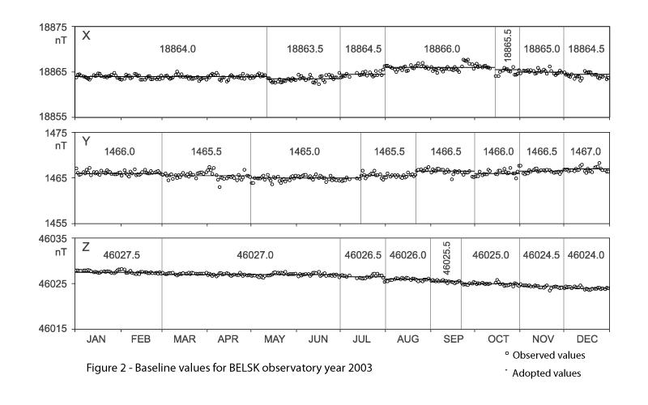

.. _proc_dat_baseline_comp:

Computation of Baseline Values
==============================

.. include:: ../../appendices/appendices.rst

The component baseline values are calculated as described in
:numref:`sub_dat_def_calc` and reported in the format described in |app_imag_ibf|.

.. _proc_dat_baseline_comp_belsk:

    Baseline values for Belsk observatory 2003
