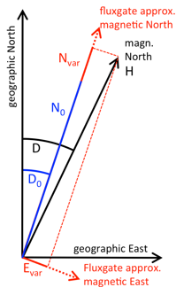

.. _sub_dat_def_calc:

Definitive Data Calculation Based On Most Common Orientation
============================================================

Fluxgate variometers usually have 3 orthogonal fluxgate
sensors. These sensors can be oriented in various ways. Most
variometers are designed such that two sensors are horizontal
and a third sensor is vertical. If the two horizontal sensors
are oriented towards geographic north and east, respectively,
then the orientation is often referred to as XYZ. If they are
approximately oriented towards magnetic north (i.e.
approximately along the local H component) and magnetic east,
then the orientation is called HDZ. There exist other
orientations, but these are less frequently used. One example
is to mount two horizontal sensors approximately 45° on either
side of geomagnetic north and one sensor along Z. Another
example is to align one sensor approximately along the field
vector, one sensor horizontal towards east, and one sensor
perpendicular to the other two sensors, in which case the three
fluxgates will sense magnetic field variations that
approximately reflect changes in field strength F, declination
D and inclination I.

There are two types of fluxgate sensors. One type is
quasi-absolute and measures the full field component (up to
70000 nT) or more. As every fluxgate, it has an unknown sensor
offset which typically is small (a few nT). The other type is a
variation-type fluxgate with a limited measurement range
(typically 6000 nT to 20000 nT). The variation-type requires
bias fields to be applied along the fluxgate in order to
compensate for geomagnetic field components that exceed the
measurement range. The bias field can be very large (up to
70000 nT or more) and adds to the small sensor offset. Both
bias field and sensor offset are not known accurately, but are
assumed to be stable between absolute measurements.

Here, we first describe the calculation of definitive data
based on the HDZ orientation and later for the XYZ orientation,
as this is one of the most commonly used orientations. In
particular, we consider a variometer-type instrument with
selectable bias fields for the individual channels. The HDZ
orientation was also the typical orientation for classical
instruments with suspended magnets and photographic recordings.
With the classical instruments, often simple, linear formulas
were used to calculate absolute data from variations and
baselines. For this procedure to be sufficiently accurate, the
classical instruments required reorientation with changing
declination (typically every few years). With the non-linear
formulas given here, it is not necessary to reorient the
fluxgate variometer with changing declination (as long as the
magnetic field stays within the measuring range of the
fluxgates, which is typically the case for decades).

The horizontal sensor directions do not exactly correspond to
the magnetic field components H and D. In order not to confuse
the sensor directions with the magnetic field components HDZ,
we label the sensors N for horizontally north, E for
horizontally east and V for vertically down. We denote
:math:`N_{var}`, :math:`E_{var}` and :math:`V_{var}` the fluxgate
output in nT, positive towards north, east and down,
respectively. We denote :math:`N_0`, :math:`E_0` and
:math:`V_0` the sum of the (stable) bias fields necessary to
compensate field components, the sensor offsets and the pillar
differences (between the main absolute pillar and the
variometer pillar, see below) for the sensors N, E and V,
respectively. The angle between geographic north and sensor N
is labelled :math:`D_0`.

We begin with reviewing the assumptions that are made for the
formulas that we use here to be valid:

#. The three fluxgates N, E, V have to be orthogonal.
#. The fluxgates N and E have to be horizontal, the
   fluxgate V has to be vertical.
#. Fluxgate E points roughly towards magnetic east. It
   requires a negligibly small sensor offset and a zero bias
   field, i.e., :math:`E_0` can be assumed to be zero.
#. Fluxgate N points roughly towards magnetic north, i. e.,
   :math:`D_0` is similar to declination D.
#. We assume that the magnetic north direction (declination
   D) at the variometer is identical to the magnetic north
   direction at the main pillar of the observatory, where
   declination is measured.

:numref:`sub_dat_def_calc_vario` depicts this situation for horizontal fluxgate sensors
E and N and their output in nT, :math:`N_{var}` and :math:`E_{var}`.
:math:`D_0` is now the baseline of declination,
its physical meaning is the orientation of the fluxgate
variometer, expressed as the angle from geographic (true) north
to the N sensor. :math:`N_0` is the baseline of the H
component, its physical meaning is the bias plus offset of the
fluxgate sensor N. Likewise, :math:`V_0` is the baseline of the
vertical component and its physical meaning is the bias and
offset of that sensor.

While the relationship between the absolute values Z, baselines
:math:`V_0` and variations :math:`V_{var}` for Z component is
simply linear (1a), the relationship for H (1b) and D (1c) can
be derived from :numref:`sub_dat_def_calc_vario`:

.. _sub_dat_def_calc_vario:

    Horizontal field component H and horizontal sensors of the variometer
    for the HDZ orientation.

.. math::

 (1a)\qquad  Z(t) &= V_0(t) + V_{var}(t) \\
 (1b)\qquad  H(t) &= \sqrt{(N_0(t) + N_{var}(t))^2 + E_{var}^2(t)} \\
 (1c)\qquad  D(t) &= D_0(t) + atan{(\frac{E_{var}(t)}{N_0(t)+V_{var}(t)})} \\

with :math:`N_0` being the baseline of the horizontal component
and :math:`D_0` being the baseline of declination.
:math:`N_{var}` and :math:`E_{var}` are variations in nT. Note that
the definitive values at the absolute pillar can be calculated
for any time t, for which both final adopted baselines and
checked and cleaned variation recordings are available.
Note also, that if either :math:`E_{var}` or :math:`N_{var}`
is missing, then neither H nor D can be calculated.

For completeness, we give the formulas that are necessary to
calculate baselines from absolute measurements that have been
performed at a point in time :math:`t_1`. These can easily be
derived from (1a) to (1c):

.. math::

 (2a)\qquad  V_0(t_1) &= Z(t_1) - V_{var}(t_1) \\
 (2b)\qquad  N_0(t_1) &= \sqrt{(H^2(t_1)  - E_{var}^2(t_1)} - N_{var}(t_1)) \\
 (2c)\qquad  D_0(t_1) &= D(t_1) - atan{(\frac{E_{var}(t_1)}{N_0(t_1)+V_{var}(t_1)})} \\

In the case of the absolute values :math:`H(t_1)`,
:math:`D(t_1)` and :math:`Z(t_1)` all appropriate pillar
differences have to be included such that the absolute values
represent the magnetic field at the observatory's main pillar.
Since the observed baseline values :math:`N_0(t_1)`,
:math:`D_0(t_1)` and :math:`V_0(t_1)` are
determined as a difference between measurements on two pillars,
they also incorporate the pillar difference between the main
pillar and the variometer pillar. From the resulting observed
baseline values :math:`N_0(t_1)`, :math:`D_0(t_1)` and :math:`V_0(t_1)`
the continuous final baselines :math:`N_0(t)`, :math:`D_0(t)`
and math:`V_0(t)` are adopted and used for the calculation
of definitive data as described above in formula (1a) to (1c).

If the XYZ-orientation is used, we label the fluxgates X, Y and
Z.

.. note::

 To avoid confusion, that these are the identical
 symbols as used for the geomagnetic components X, Y and Z, and
 that you have to determine from the context whether the sensors
 or the geomagnetic components are being referenced.
 We also refer to the vertical sensor as V before.

We assume the sensors X, Y and Z are aligned exactly along the magnetic
components X (North), Y (East) and Z (vertical). It is thus not
trivial to physically set up a magnetometer exactly in this
direction.
Then, all formula become linear: :math:`X(t) = X_0(t) + X_{var}(t)`
with :math:`X_0` being the baseline (bias plus offset in nT)
and :math:`X_{var}(t)` being the variometer output of the X sensor;
:math:`Y(t) = Y_0(t) + Y_{var}(t)` with :math:`Y_0` being the
baseline (bias plus offset in nT) and :math:`Y_{var}(t)` being
the variometer output of the Y sensor; :math:`Z(t) = Z_0(t) + Z_{var}(t)`
with :math:`Z_0` being the baseline (bias plus offset in nT)
and :math:`Z_{var}(t)` being the variometer output of the Z sensor.
