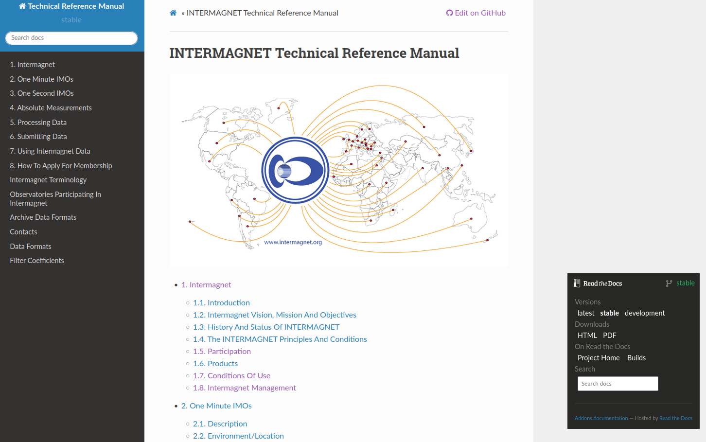

.. _use_dat_imag_web:

INTERMAGNET WEB Site
====================
.. include:: ../../shared/variables.rst
.. include:: ../../shared/targets.rst
.. include:: ../../appendices/appendices.rst


The INTERMAGNET web site provides background information about
INTERMAGNET, its structure, and participating
organizations, countries and IMOs (INTERMAGNET Magnetic
Observatories).

The web site offers access to various data products:

* The annual definitive data published with a
  Digital Object Identifier (DOI).
* Magnetograms and data files of reported and adjusted
  minute values from all the IMOs.
* The Online Technical Reference Manual.
* The INTERMAGNET application form.

INTERMAGNET moved away from in-house maintained servers towards
free cloud-based possibilities to deploy the web site.

The following underlying technologies were selected for the web site :

* a GitHub repository for all software, web site development and discussion forums : |intermagnet_github|
* The INTERMAGNET web site has been designed using  GitHub Pages (|git_hub_pages|).
* The Online Technical Reference Manual is produced using the  `sphinx framework`_ making it possible to generate both pdf and html versions of the manual
  The manual is automatically built and deployed using the services offered by `readthedocs.org`_.

The metadata and online data are hosted by the British Geological Survey (BGS). The annual definitive data are
deployed on the servers of the German Research Centre for Geosciences (GFZ). 


.. _use_dat_imag_web_addr:

WEB Site Address
----------------

The INTERMAGNET web site address is: |intermagnet_website|.
This gives access to the home page from where required information about INTERMAGNET is available.
The source code is available on the INTERMAGNET GitHub.


.. _use_dat_imag_web_online_tech_man:

Online Technical Reference Manual
---------------------------------

The Online Technical Reference manual can be found on the subdomain |techman_website|. It is also possible to download the manual in different formats.



    Online Technical Reference manual

On the left side, you will find links to download the manual in PDF or HTML format.
There are three versions available :

#. stable : The latest official release (the most up to date version to be used as a reference).
#. latest : The current working version with accepted changes but not ready for an official release.
#. development : This version may contain errors and/or proposed changes not yet accepted.

The stable version should be the only one used as reference.


.. _use_dat_imag_web_down_data:

Downloading Data
----------------

Geomagnetic observatory data can be downloaded using a web browser by either using DOIs for definitive  data or
using the web data distribution interface for all data types including definitive data.
Until 2015, the annual definitive data was released on a physical media (see |app_imag_dir|).
From 2015 onward, the intermagnet definitive data is published yearly with a Digital Object Identifier (DOI) which includes
all definitive data since 1991 to the publication year.

.. _use_dat_imag_web_down_data_doi:

Downloading Data Using DOIs
```````````````````````````
Beginning with the publication of the definitive data for 2015, INTERMAGNET stopped
publishing individual years of data and started publishing the entire, cumulative
definitive data set since INTERMAGNET’s first recorded definitive data in 1991.

This DOI-referenced annual data set is known as the "INTERMAGNET Reference Data Set" (IRDS).
The IRDS comprises all INTERMAGNET one-minute definitive data since 1991 and is annually updated
with a new year and occasional corrections to previous releases.
The different releases of the IRDS can be found on the INTERMAGNET web site :|imag_data_con|.

The IRDS are deployed on the servers of the GFZ German Research Centre for Geosciences.
File names for IRDS data are formatted in the form mag<year>_def<year>.zip.
The mag<year> section of the filename describes the year in which the data was
recorded. The def<year> section of the filename describes the most recent annual
INTERMAGNET publication in which the data was updated. Files where mag<year> = def<year>
have had no corrections since their original publication. For example, "mag2015_def2016"
indicates that this file is different from the first release "mag2015_def2015".

The zip archive is organized in a number of
subdirectories. Most of them are named with observatory IAGA codes,
they contain information regarding a particular observatory.
Further subdirectories provide country information about
national operators of magnetic observatories. A complete set
for one observatory consists of the following files (this
example is for the year 2010):

#. x:\\mag2010\\sss\\sss10mmm.bin (12 binary files in IAF format)
#. x:\\mag2010\\sss\\readme.sss (1 readme file)
#. x:\\mag2010\\sss\\sss2010.blv (1 baseline file)
#. x:\\mag2010\\sss\\yearmean.sss (1 annual means file)
#. x:\\mag2010\\sss\\sss10k.dka (1 text file of K-indices)
#. x:\\mag2010\\2010maps\\country_id.xxx (1 map for each country (xxx = png or pcx))
#. x:\\mag2010\\ctry_inf\\readme.country_id (1 readme-file for each country)
#. x:\\mag2010\\ctry_inf\\country_idsrn.xxx (1 about-screen for each country
   (xxx = png or pcx))

Where:

-  sss is the 3-letter observatory IAGA code
-  mmm is the month
-  country_id is the three-letter country code

#. A binary file in IAF format (described in detail in :numref:`sub_dat_1min_data`
   and |app_iaf|) includes minute values as well as
   other accompanying data such as: metadata headers W01-W16, K indices,
   hourly and daily mean values.
#. A text file readme.sss contains meta-data and information 
   about the observatory such as location, parent
   institute, personnel, equipment and instrumentation etc.
#. A text file sssyyyy.blv includes results of absolute control
   of geomagnetic observations and adopted baseline values. The format of this file is
   described in |app_imag_ibf|. Baseline data are considered by
   many experts as an indicator of data quality, especially with regard to observation of
   secular variation.
#. A text file yearmean.sss includes a listing of annual mean
   values for the observatory. The format of this file is
   described in |app_iyf|. Most observatories publish all
   annual means, i.e. since the beginning of their activity.
   Some observatories also publish annual means for international geomagnetic quiet-days
   and disturbed-days.
#. A text file sssyyk.dka includes K-indices. DKA files are created by
   INTERMAGNET from the K index data includied in binary IAF files. if K-indices are not 
   scaled by the IMO there is no DKA file.
#. The image file country_id.xxx shows the location of observatories of a
   given country.
#. The text file readme.country_id provides information about
   parent institute(s) in a given country.
#. The image file country_idsrn.xxx provides information about parent institute(s)
   managing IMOs in a given country in graphical form.


After unzipping the archive data can be accessed using INTERMAGNETs IMCDViewer software available for  downloaded from the web site : |imag_software|.
See :numref:`use_dat_data_view` for more info on the usage of this Data Viewer.


.. _use_dat_imag_web_down_data_web:

Downloading Data Using the WEB Interface
````````````````````````````````````````

Reported and adjusted intermagnet data are available for many IMOs in near real-time.
The availability of data files is dependent on the
publishing delay and data embargo policy of participating institutes. If there is no
publishing delay, data are available within 10 to 20 minutes
after being placed on the server. The data covers the period
from 1991 to present. In addition to data of reported and adjusted quality,
quasi-definitive and definitive data may also be available for one-minute 
or one-second sampling rates in various data formats. Data are also available
via web services and ftp. For further details and to download data, you can consult 
the INTERMAGNET web site: |download_plot_data|

Plots of magnetic observatory data and information derived from
the data are also available. These include:

-  Plots of X, Y, Z magnetic field components
-  Plots of H, D, Z magnetic field components
-  Plots of declination and inclination


.. _use_dat_imag_web_geo_act:

Geomagnetic Activity
--------------------

A map of geomagnetic activity is currently under development. 
The magnetic activity maps will show the range of the magnetic
variation in each hour at INTERMAGNET observatories around the
world. For recent events only those observatories with fast
reporting capabilities can be presented. 
